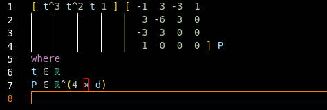
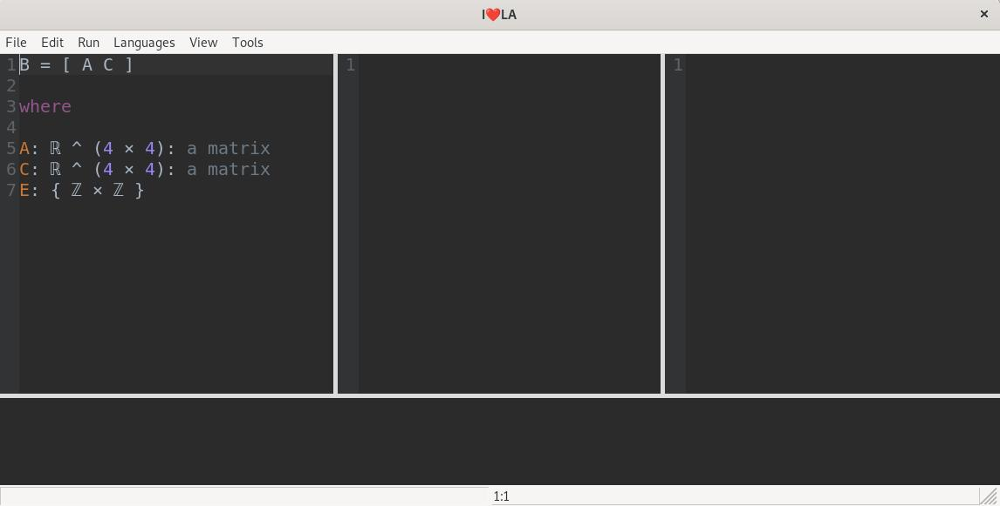
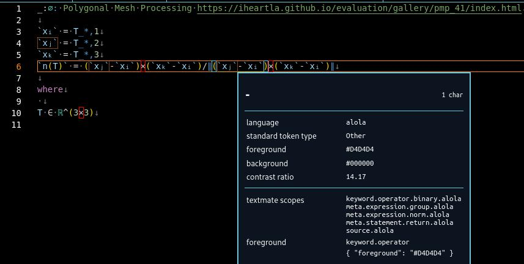

# I❤️LA VSCode Extension

This seminar project has been dedicated to developing an extension for Visual Studio Code which should ease the introduction into the language and its pratical use.



The extension contributes a functional complex context-free and _beautiful_ syntax highlighting and context-free grammar parsing of lexical scopes for the language. It also has some unfinished code for semantic highlighting of variable occurences. Semantic highlighting would have been particularly useful since I❤️LAs grammar is context senstive. Most notably the juxtaposition of variables which allows writing variables in immediate sequence, i.e. `a ∈ ℝ` and `b ∈ ℝ` can be multiplied by writing `ab`. Some operators and other syntactic elements use the same symbol, e.g. `(a , b)`as a vector,`(a + b)`as a subexpression,`< v , w >`as a scalar product,`a < b` as a condition, `:` as either a delimiter for matrix conditions or for the Frobenius inner product between matrices. Besides symbols, deciding start and end of sparse matrix literals (looking like a case differentation started with the `{` symbol) and optimization expressions require knowledge about the type of expression to delimit the block of optimization constraints from following statements.

No other features have been finished in time.

## Compiling I❤️LA

Compilation of I❤️LA is not required for the current state of the extension and therefore optional but may be useful for offline testing and use.

I❤️LA is hosted [on Github](https://iheartla.github.io/) but the releases neither provide an installable package nor a precompiled binary for Windows or Linux-based systems. The project is written in Python and therefore PyInstaller is required to manually compile the project. Fortunately an `iheartla.spec` exists which is used by `pyinstaller`. Compiling with PyInstaller on Ubuntu does not work out of the box. Line 24 in `iheartla.spec`

```py
a = Analysis(['app.py'],
```

needs to be

```py
a = Analysis(['iheartla/__main__.py'],
```

I❤️LA ships with a GUI which uses `wxpython`. Before compilation, the dependencies must be installed with

```sh
pip3 install -r ./requirements.txt
```

in the root of the repository.

After installing `pyinstaller` with `pip3`, it can be used as a shell command. The project can be compiled by invoking

```sh
pyinstaller ./iheartla.spec
```

in the root of the repository. The output will be in a `dist` folder. When the compiled executable fails to start, shared libraries can be pasted in the folder of the executable.

The following image shows the GUI, when the application is started:



## TextMate Grammars

There was no reusable grammar available besides the original PEG python grammar, so a new TextMate grammar had to be written from scratch. TextMate grammars for VSCode are typically written in JSON. But since I❤️LA has a fairly complex grammar, the RegExps for parsing lexical scopes and tokens are too complex for writing the RegExp expressions in JSON.

Therefore, the grammar was written in YAML and a launch task was created which translates YAML automatically to JSON. In order for this task to succeed, `js-yaml` needs to be installed as a shell command via `npm install -g js-yaml` (`-g` also makes this tool available outside of the current project).

The general concept of a TextMate grammar revolves around **Oniguruma RegExp** expressions. So called "pattern" objects consist of a RegExp, a mapped name for the match, as well as further patterns and names that can be applied on the captured content of capturing groups. This RegExp flavor is used by the Ruby programming language and has been used to define the original format in the TextMate editor. Oniguruma RegExps are mostly equal to PCRE RegExp with only minor differences and some limitations.

[...]

### Limitations of TextMate Grammars

TextMate grammars only work with single lines at a time, by design, stated performance as a reason. Thus, the RegExp expressions cannot have a lookahead over the current line which would otherwise allow for context sensitive Oniguruma RegExp. To circumvent this limitation, TextMate Grammars allow multi-line matches via a pair of `begin` and `end` RegExp. Also a `begin`, `while` pair exists but which loops over whole lines, particularly catering to Markdown parsing and therefore is not useful for exact delimitation of text within the lines.

## Using the extension in VSCode

In order to run and test the extension, the project has to be copied to a local computer where VSCode is installed.
Open the repository root folder in VSCode with `CTRL+K CTRL+O`.

Run `npm install` once in the root of the directory (which should be optional). The extension can be launched conveniently with `CTRL+F5`.

## Examples & Features

A list of examples selected by the authors can be found [here](https://iheartla.github.io/evaluation/gallery/index.html) which can be tested with the extension.



Extension features shall be mentioned in the `CHANGELOG.md` and the `README.md` in the repository's root directory.

## References

[^1] [^2] [^3] [^4]

[^1]: *Official TextMate Grammar Documentation (incomplete)* , [https://macromates.com/manual/en/language_grammars](https://macromates.com/manual/en/language_grammars)
[^2]: *Writing a TextMate Grammar: Some Lessons Learnt* , February 18, 2014 by Matt Neuburg , [https://www.apeth.com/nonblog/stories/textmatebundle.html](https://www.apeth.com/nonblog/stories/textmatebundle.html)
[^3]: *Syntax Highlighting Guide* , [https://code.visualstudio.com/api/language-extensions/syntax-highlight-guide](https://code.visualstudio.com/api/language-extensions/syntax-highlight-guide)
[^4]: *Semantic Highlighting Guide* , [https://code.visualstudio.com/api/language-extensions/semantic-highlight-guide](https://code.visualstudio.com/api/language-extensions/semantic-highlight-guide)